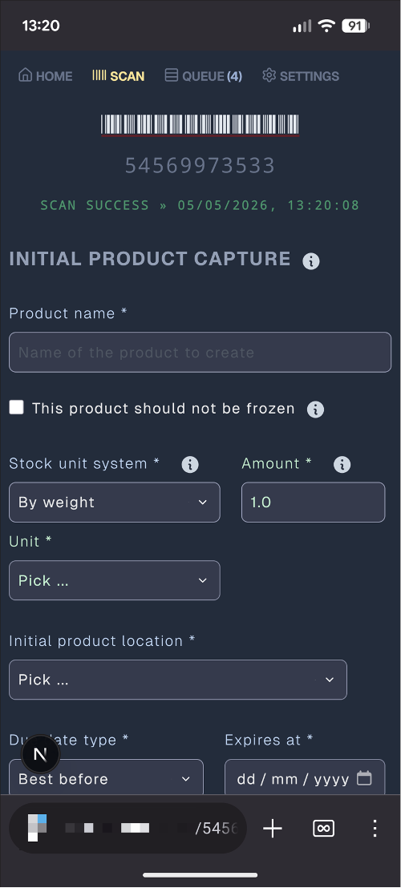
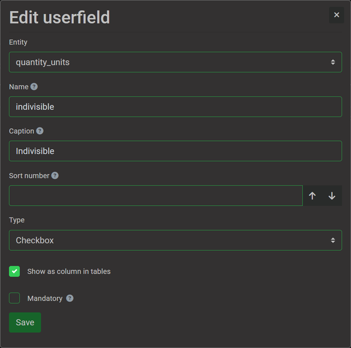
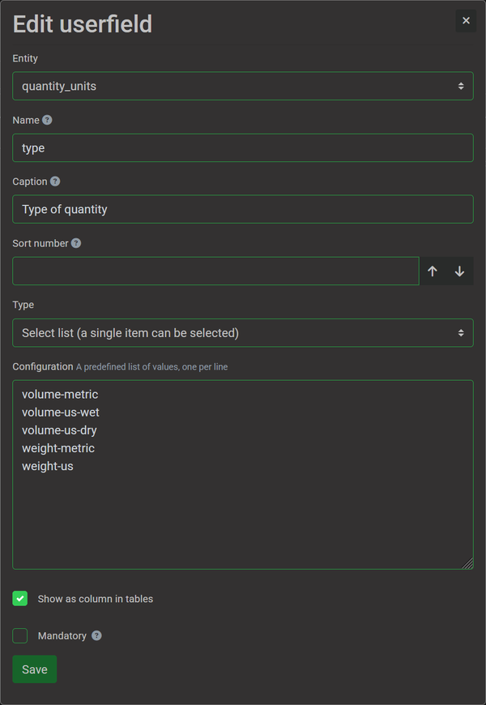
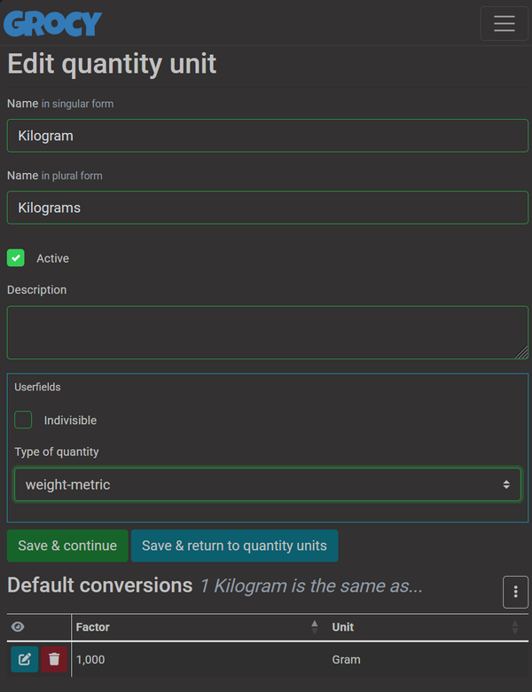
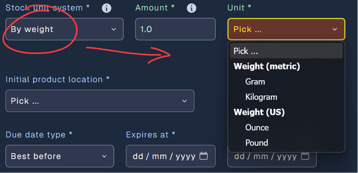
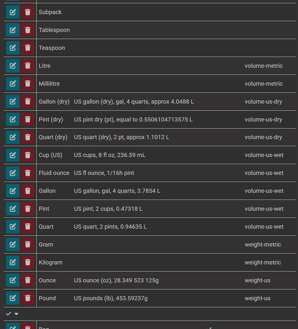
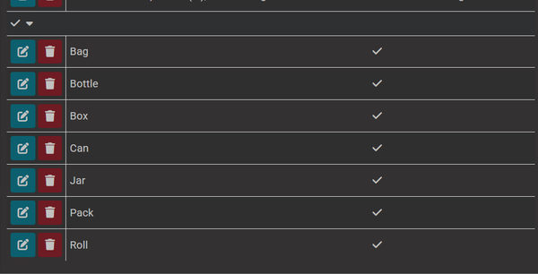

# Grocy Barcode Wizard

Grocy Barcode Wizard (I'll simply call it **BCW** as that stands out better for me, though it _requires_ Grocy to be of any use to anyone) is a front end for barcode scanning and related inventory tasks in Grocy, similar in nature to [Barcode Buddy](https://github.com/Forceu/barcodebuddy) and [Grocy scanner](https://github.com/manuel-rw/grocy-scanner).

Where it primarily differs is:

- It's created with mobile first in mind; anything not working extremely well on mobile is considered a bug.
- New products are entered "by weight", "by volume" or "by abstract/discrete units" to make setting up the product quick and easy.
- The UI somewhat adapts to your choices interactively. If you set the flag that something should not be frozen then any related settings will be hidden.
- There are no modals in the UI; everything is either a page of its own or dynamic adapting UI.
- The photo you take of your product can be cropped.
- It's opinionated on what the units and conversions in Grocy need to be, and requires some setup in Grocy. This however makes it really quick to create new products even without ever going to Grocy itself.
- New product capture is a two stage process.
  1. Stage one lets you quickly capture the essentials of a previously unknown product, after which you can put the product away; this is essential for things that require refrigeration or freezing as entering product data can take a lot of time if you encounter different products all the time like we do in Denmark.
  2. Stage two can be done at any time after scanning your products. This is where you go through all the products that had to be queued. You can refine any further product setup, and then create them as actual products and inventory in Grocy.



**For now you need a barcode scanner for this project to be of any use to you.** You'll have to set up a script to read the barcodes from where the barcode scanner is connected to, and send them on to BCW's API. Barcode scanning through a camera is not implemented at the moment.

It is developed using [Next.js](https://nextjs.org), and intended to be run as a docker container, though it can be made to run anywhere Next.js applications can be deployed to.

## Requirements

- A barcode scanner, with some software to intercept the input and pass it on to the BCW API (for which the endpoint is similar to and compatible with the Barcode Buddy API, and I've been using one of the [Barcode Buddy scripts](https://github.com/Forceu/barcodebuddy/tree/master/example) for this).
- A server environment to host this program; docker is likely easiest as that's already built for you.
- A Grocy instance deployed somewhere with network access to its API. It talks to Grocy quite frequently, so for latency reasons they are ideally on the same network.
- Some kind of SSL proxy to host the service behind is highly recommended, otherwise photo capture and copy to clipboard will not work (web browser security limitation).

## How it works

BCW receives barcodes through its API endpoint which then forwards it to one of its two internal data streams. Whether receipt of a barcode will do anything more on your connected device(s) depends whether you are in the SCAN mode or not on these devices, and whether it is a regular product barcode or a "special" one.

Any special non-product barcodes (e.g. `BBUDDY-*` codes, `GRCY:R:*` grocy recipe codes, `GRCY:B:*` grocy battery codes, `VCARD` and similar QR codes) are intercepted and routed through a special barcode stream which I originally had plans for. But that original vision didn't work out so well and these special barcodes are thus _currently_ effectively ignored.

_Every_ device showing a SCAN mode page will either jump to a display of some key data about the barcode if known to grocy, jump to a "quick capture" page if the barcode is entirely unknown, or jump to a page with the option of completing the initial quick capture.

The quick capture lets you enter key details you can read off the packaging that you need for completing the data in Grocy (for example, record it's a 400g package, and 120kcal/100g) and take a photo. These initial details are captured in the database, and you can put the product away in its storage.

Barcodes which are sent to the API while a device is not showing a SCAN mode page will be ignored.

## Future plans

These are likely to happen:

- My own solution for capturing barcodes and sending them on to BCW. Maybe written in Go for a tiny docker image.
- First-rate thermal label printer support, I just don't have one yet.
- Barcode scanning through a camera.
- Better tare weight handling. Right now it's barely an afterthought and likely to have bugs (I don't use tare weights at the moment).

Possible improvements:

- Make the Grocy setup automatic: it should be possible to scan the Grocy environment and create any missing units, unit conversions and userfields for you.
- I'm considering additional Grocy feature support, such as showing its recipes. (At the very least, I should make reading recipe QR codes not do nothing and allow easy viewing in Grocy).

Possible, but not likely done by me at least:

- Internationalisation. Right now it's all hardcoded as English, no additional languages supported.
- Themeing. Right now the foreground colours have been moved to a theme, the background colours not yet. There is no way to change themes though, and it is effectively a hardcoded dark mode theme with no plans from my side to change that.
- Multi-user support and authentication. At the moment there is only one always authenticated user. Any authentication will need to happen in your SSL proxy.

## Set up

### Grocy

In your Grocy environment you need to set up some userfields.

On `quantity_units`, set up two userfields:

- `indivisible`, checkbox

  

- `type`, select list (single item can be selected) with these values:
  ```
  volume-metric
  volume-us-wet
  volume-us-dry
  weight-metric
  weight-us
  ```
  

Next you'll need to have quantity units and conversions set up for the types that you use and have them tagged with these types. So for example:

Kilogram and Gram, both type `weight-metric`, with a conversion between them of 1 kg = 1000 grams.

Litre and millilitre, both type `volume-metric`, with a conversion between them of 1 litre = 1000 millilitres.



Note you can name your units whatever you like them to be; BCW just offers the units in the dropdown grouped together based on what you have set up based on the `type` selection.



And then set up any other units and conversions between them. I don't use US units so I can't say how well these actually work, but here's what I set up for them for testing with:



Finally, set the `indivisible` flag on the abstract units where that makes sense: you can't open "half a jar", it's open or it is not. BCW should have some opinionated default choices for you based on whether a product's stock unit has this flag or not.

Here are some example units where this can make sense:




## Docker compose setup

In your docker image you configure the location of your Grocy instance and its API key. You need to set up a volume for `/app/data` which stores the database persistently.

After starting your container you need to visit the settings page (e.g. "https://bcw.example.com/settings") and create an API key there. Then take this API key and configure it in the barcode reader.

Example `docker-compose.yaml`:

```yaml
services:
  bcw:
    image: grocy-barcode-wizard:latest
    ports:
      - "3000:3000"
    environment:
      GROCY_URL: https://grocy.example.com/
      GROCY_API_URL: https://grocy.example.com/api/
      GROCY_API_KEY: "api key as set in Grocy"
    volumes:
      - bcw_data:/app/data
      - /etc/timezone:/etc/timezone:ro
      - /etc/localtime:/etc/localtime:ro
    restart: always

  reader:
    image: go-barcode-to-bcw:latest
    container_name: barcode-reader
    privileged: true
    stdin_open: true
    tty: true
    environment:
      SCANNER_VID: "0x0581"
      SCANNER_PID: "0x0115"
      API_URL: "http://bcw:3000/api/action/scan"
      API_KEY: "api key generated in BCW"
    volumes:
      - /etc/timezone:/etc/timezone:ro
      - /etc/localtime:/etc/localtime:ro
      - /dev/bus/usb:/dev/bus/usb
      - /dev/usb:/dev/usb

volumes:
  bcw_data:
```


(( ... this section is work in progress ... ))

## Development

I only support use of `pnpm`, though in theory other package managers should work too. Run the development server with:

```bash
pnpm dev
```

Open [http://localhost:3000](http://localhost:3000) with your browser to see the result; best set up your SSL proxy to serve this over https though.

# License

Copyright (c) 2026 Lianna Eeftinck liannaee@gmail.com

Permission is hereby granted, free of charge, to any person obtaining a copy of this software and associated documentation files (the "Software"), to deal in the Software without restriction, including without limitation the rights to use, copy, modify, merge, publish, distribute, sublicense, and/or sell copies of the Software, and to permit persons to whom the Software is furnished to do so, subject to the following conditions:

The above copyright notice and this permission notice shall be included in all copies or substantial portions of the Software.

THE SOFTWARE IS PROVIDED "AS IS", WITHOUT WARRANTY OF ANY KIND, EXPRESS OR IMPLIED, INCLUDING BUT NOT LIMITED TO THE WARRANTIES OF MERCHANTABILITY, FITNESS FOR A PARTICULAR PURPOSE AND NONINFRINGEMENT. IN NO EVENT SHALL THE AUTHORS OR COPYRIGHT HOLDERS BE LIABLE FOR ANY CLAIM, DAMAGES OR OTHER LIABILITY, WHETHER IN AN ACTION OF CONTRACT, TORT OR OTHERWISE, ARISING FROM, OUT OF OR IN CONNECTION WITH THE SOFTWARE OR THE USE OR OTHER DEALINGS IN THE SOFTWARE.